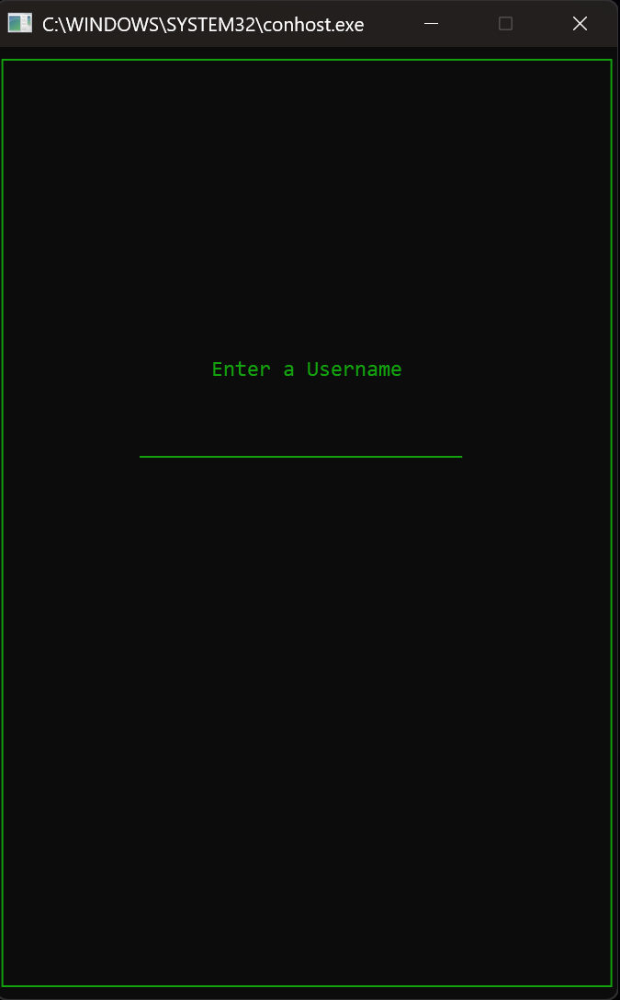
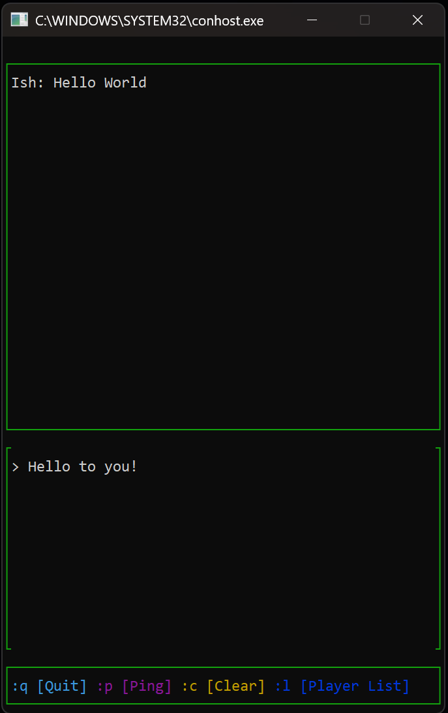

# QuickChat
 


<div style="display: flex; gap: 20px;">
  
  
</div>

A simple chatting application with minimal features

## Usage

Server and Client .exe's avaible  
For this application the server address and port are tied to enviromental variables  
Just set the variables and run the .exe

**PS1:**

```ps1
$env:SERVER_ADDRESS="127.0.0.1"
$env:SERVER_PORT="3000"
```

## Make

To build with make just sure you have the include and static-library setup for the dependencies when using make:

- **Asio**  
    Networking library, can be downloaded at:  
    [Asio Homepage](https://think-async.com/Asio/)

- **PDCurses**  
    Windows version of Ncurses, can be downloaded at either:  
    [Github](https://github.com/wmcbrine/PDCurses) or [SourceForge](https://sourceforge.net/projects/pdcurses/)

- **Blake3**  
    Implementation of BLAKE3 hashing algorithim, can be downloaded at:  
    [Github](https://github.com/BLAKE3-team/BLAKE3/tree/master)
